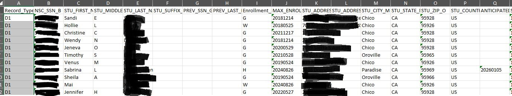

## R Markdown
This is an R Markdown document. Markdown is a simple formatting syntax for authoring HTML, PDF, and MS Word documents. For more details on using R Markdown see <http://rmarkdown.rstudio.com>.

When you click the **Knit** button a document will be generated that includes both content as well as the output of any embedded R code chunks within the document.

Set your working directory and parameters in the next chunk:

```{r setup, include = FALSE}
knitr::opts_chunk$set(echo = TRUE)

#Libraries
library(openxlsx) #Write to Excel File
library(tidyr) #Data Manipulation
require(odbc) #Database Connection
library(magrittr) #Piping
library(purrr) #Piping

setwd("Y:/RProjects/NSC Graduates Only File")
getwd()

```

## Program Specifics
This R Markdown document will:
  1) Connect to the EnrollmentMgmt database.
  2) Pull data necessary for the NSC Graduates Only File
  3) Create and save an Excel file - **Graduates Only File**
  
Once this process completes, there are steps that must be done for data clean-up and column formatting in the Excel file before submission. Please see https://theclearinghouse.download/erguide for file specifications. **This R-Markdown document was designed to comply with version 3.7 April 2024 of the Enrollment Reporting Programming and Testing Guide.**

## Excel File Clean-up
The file produced should look similar to this:
```{r pressure, echo=FALSE, out.width = '100%'}

```

The header row names include the appropriate column name in the title.  For example STU_FIRST_NAME_C belongs in column C. 

There are several columns that will need to be **deleted** before submission. These columns have "Not_Submitted" in the column names. They are included in the original file for trouble shooting and readability purposes.

The NSC file specs only allow for 6 programs to be reported in a file. The columns that relate to programs beyond 6 will need to be deleted before submitting the file. It is recommended that using the filter tool in Excel, filter column **NSC_CIP_AW_7** to show non-blanks and cut and paste the row results from all columns into a second **workbook**. Then delete the **columns** that pertain to programs 7 and beyond. All these columns are labeled _7, _8, _9,  etc.

The pivoted Academic Program specific columns are not automatically put in order. You will need to manual cut and paste columns in the file spec order. However all columns are labeled to make this task easier and less error prone. Note that columns **Privacy_Block_DE** through **Filler_DK** will need to be shifted to column DE through DK they are initially stored starting in column AW before the academic program data.

Any commas in the file need to be deleted as they will break the upload process. Search and delete/replace.

Check addresses for easy fixes like zip codes being reported in Address_Line_2.

Delete rows of students who do not have SSN's

## Gainful Employment FVT Graduate Reconciliation File (GRF)
The GE-FVT Grad Reconciliation File (GRF) may have too many SSN's to include in the SQL code for this program. This is the case for Butte's file. The workaround we used was to run the SQL code without limiting the SSNs.  Prior to submission, we used a VLOOKUP function in Excel to compare the returned SSNs in the Graduates Only File to the GRF. Student rows for SSN's not included in the GRF were deleted in the Graduates Only File  


## Ready for Submission
Once the Excel file is clean, remove the column name header row. Create a Header row and Trailer row as specified in the NSC guide. Save the file as a tab separated .txt file give it the name appropriate for submission.  For Butte College this is 00807300.txt Once the file is saved, change the file extension in widows explorer to .CLR The file is now ready for submission via the NSC's FTP process. 

# Code
## Opens a DB Connection
```{r echo=TRUE}

openDBConnection <- function() {
  db <- dbConnect(odbc::odbc(), .connection_string = "Driver={SQL Server};
        server=bearhouse.briarpatch.bcc;\ndatabase=EnrollmentMgmt;\ntrusted_connection=true", timeout = 10)
  return(db)
}

db <- openDBConnection()
```


## SQL for Pulling Data that is Used for the Graduates Only File
Note some dates are hard coded to reflect period for GE-FVT reporting
```{r echo=TRUE}

NSC_GRADS <- function() {
  
  qNSC_GRADS <- sprintf("SELECT 'D1' Record_Type_A,
  CONCAT(LEFT(SSN, 3), SUBSTRING(SSN,5,2), RIGHT(SSN,4)) NSC_SSN_B, 
LEFT(STUDENT.STU_FIRST_NAME, 20) STU_FIRST_NAME_C, 
LEFT(STU_MIDDLE_NAME, 1) STU_MIDDLE_D, 
LEFT(STUDENT.STU_LAST_NAME, 20) STU_LAST_NAME_E, 
STU_SUFFIX STU_SUFFIX_F,
'' PREV_SSN_G,
'' PREV_LAST_NAME_H,
CASE
    WHEN G_END_DATE BETWEEN NSC_STATUS.LSE_ARC_TERM_BEGIN AND NSC_STATUS.LSE_ARC_TERM_END THEN 'G'
    WHEN G_END_DATE >= NSC_STATUS.LSE_ARC_TERM_END THEN 'G'
    WHEN G_END_DATE < NSC_STATUS.LSE_ARC_TERM_BEGIN AND NSC_STATUS.LSE_ARC_TERM_BEGIN < '08-26-2024' THEN 'W'
    WHEN NSC_STATUS.LSE_ARC_TERM_BEGIN >= '08-26-2024' THEN NSC_STATUS.LSE_ARC_ENR_STATUS
    ELSE NULL
END Enrollment_Status_I,
CASE
    WHEN NSC_STATUS.LSE_ARC_TERM_END >= GETDATE() THEN FORMAT(CAST(NSC_STATUS.LSE_ARC_TERM_BEGIN AS DATE), 'yyyyMMdd')
    ELSE FORMAT(CAST(NSC_STATUS.LSE_ARC_TERM_END AS DATE), 'yyyyMMdd')
END MAX_ENROLLMENT_STATUS_START_J,
LEFT(REPLACE(STU_ADDRESS1, ',',''), 30) STU_ADDRESS1_K,
LEFT(REPLACE(STU_ADDRESS2, ',',''), 20) STU_ADDRESS2_L,
REPLACE(STU_CITY, ',','') STU_CITY_M,
STU_STATE STU_STATE_N,
STU_ZIP STU_ZIP_O,
CASE
	WHEN STU_COUNTRY IS NULL THEN 'US'
ELSE STU_COUNTRY
END STU_COUNTRY_P,
CASE
    WHEN NSC_STATUS.LSE_ARC_TERM_BEGIN >= '08-26-2024' THEN FORMAT(CAST(LSE_ARC_ANT_GRAD_DATE AS DATE), 'yyyyMMdd')
    ELSE NULL 
END ANTICIPATED_GRAD_DATE_Q,
FORMAT(CAST(STU_BIRTH_DATE AS DATE), 'yyyyMMdd') STU_BIRTH_DATE_R,
FORMAT(CAST(NSC_STATUS.LSE_ARC_TERM_BEGIN AS DATE), 'yyyyMMdd') TERM_BEGIN_DATE_S,
FORMAT(CAST(NSC_STATUS.LSE_ARC_TERM_END AS DATE), 'yyyyMMdd') TERM_END_DATE_T,
'' FILLER_U,
CASE
	WHEN STU_PRIVACY_FLAG IS NULL THEN 'N'
ELSE 'Y'
END DIRECTORY_BLOCK_INDICATOR_V,
'' MAJOR_CIP_1_W,
'' MAJOR_CIP_2_X,
'' MAJOR_COURSE_STUDY_Y,
'' MAJOR_COURSE_STUDY_Z,
'' CLASS_LEVEL_AA,
'' FIRST_TIME_FT_AB,
'' DEGREE_SEEK_AC,
'' HIGH_SCHOOL_CODE_AD,
'' STU_SEX_AE,
'' STU_ETHNICITY_AF,
STUDENT_ID STUDENT_ID_AG,
'' STATE_STUDENT_ID_AH,
'' EMAIL_AI,
'' GOOD_STUDENT_AJ,
'' MID_NAME_AK,
'' STU_VET_STATUS_AL,
'' FILLER_AM,
'' PELL_AN,
'' REMEDIAL_FLAG_AO,
'' CITIZENSHIP_AP,
'' STUDENT_PHONE_TYPE_AQ,
'' PREFERED_PHONE_FLAG_AR,
'' PHONE_CNTRY_AS,
'' STU_PHONE_AT,
'' MOVE_TO_OPEID_AU,
'Y' PROGRAM_INDICACTOR_AV,
LEFT(ACP_CIP_CODE,2)+RIGHT(ACP_CIP_CODE, 4) NSC_CIP_AW,
'2020' CIP_YEAR_AX,
CASE 
    WHEN ACP_DEG_CERT_TYPE LIKE 'C%%' THEN '01'
    WHEN ACP_DEG_CERT_TYPE LIKE 'A%%' THEN '02'
    ELSE ACP_DEG_CERT_TYPE
END NSC_AWARD_LEVEL_AY,
FORMAT(ACP_MONTHS_TO_COMPLETE * 1000/12,'00000#') PROGRAM_LENGTH_AZ,
'Y' PROGRAM_LENGTH_MEASURE_BA,
 '' WEEKS_PROGRAM_TITLE_IV_BB,
FORMAT(CAST(SDC_START_DATE AS DATE), 'yyyyMMdd') PROGRAM_BEGIN_BC,
'N' SPEC_PROGRAM_INDICATOR_BD,
'G' PROGRAM_ENR_STATUS_BE,
FORMAT(CAST(SDC_END_DATE AS DATE), 'yyyyMMdd') PROGRAM_ENR_STATUS_EFF_DATE_BF,
CASE
	WHEN STU_PRIVACY_FLAG IS NULL THEN '00'
ELSE '01'
END PRIVACY_BLOCK_DE,
'' PREVIOUS_FIRST_NAME_DF,
'' LIVED_FIRST_NAME_DG,
'' LIVED_MIDDLE_NAME_AN,
'' LIVED_LAST_NAME_DI,
'' GENDER_IDENTITY_DJ,
'' FILLER_DK,
ACP_PROGRAM_TYPE ACP_PROGRAM_TYPE_NOT_SUBMITTED,
ACP_DEG_CERT_TYPE ACP_DEG_CERT_TYPE_NOT_SUBMITTED,
ACP_TITLE TITLE_NOT_SUBMITTED,
ROW_NUMBER() OVER (Partition BY STUDENT_ID ORDER BY STUDENT_ID) as [Program_Numb]
FROM STUDENT
INNER JOIN colleague_staging..PERSON ON PERSON.ID = STUDENT_ID
INNER JOIN STUDENT_DEG_CERT ON STUDENT_ID = SDC_STUDENT_ID
--FIND HISTORICAL COLLEGE ENROLLMENT STATUS TO MATCH NSC DATA
INNER JOIN 
    (SELECT LR_STD_ENR_ARCHIVE.LSE_ARC_STU_ID, LSE_ARC_ENR_STATUS, LSE_ARC_TERM_BEGIN, LSE_ARC_TERM_END, LSE_ARC_ANT_GRAD_DATE
    FROM colleague_staging..LR_STD_ENR_ARCHIVE
    INNER JOIN 
        (SELECT LSE_ARC_STU_ID, MAX(LR_STD_ENR_ARCHIVE_ID) MAX_ARCHIVE
        FROM colleague_staging..LR_STD_ENR_ARCHIVE
        GROUP BY LSE_ARC_STU_ID) FINAL_STATUS_DATE
    ON LR_STD_ENR_ARCHIVE.LSE_ARC_STU_ID = FINAL_STATUS_DATE.LSE_ARC_STU_ID
    AND LR_STD_ENR_ARCHIVE_ID = MAX_ARCHIVE) NSC_STATUS
ON NSC_STATUS.LSE_ARC_STU_ID = STUDENT_ID
--FIND LAST GRAD STATUS DATE
INNER JOIN (SELECT SDC_STUDENT_ID G_STUDENT_ID, MAX(SDC_END_DATE) G_END_DATE
    FROM STUDENT_DEG_CERT
    WHERE SDC_END_DATE BETWEEN '08/22/2016' AND '09/11/2024'
    GROUP BY SDC_STUDENT_ID) COLL_GRAD_STAT
ON G_STUDENT_ID = SDC_STUDENT_ID
INNER JOIN ACADEMIC_PROGRAM ON SDC_ACADEMIC_PROGRAM = ACADEMIC_PROGRAM_ID
INNER JOIN colleague_staging..ACAD_PROGRAMS_LS ACLS1 ON ACADEMIC_PROGRAM_ID = ACLS1.ACAD_PROGRAMS_ID AND ACLS1.POS = 1
INNER JOIN colleague_staging..ACAD_PROGRAM_REQMTS APR ON ACADEMIC_PROGRAM_ID+'*'+ACLS1.ACPG_CATALOGS=APR.ACAD_PROGRAM_REQMTS_ID
INNER JOIN colleague_staging..ACAD_PROGRAM_REQMTS_LS APRL ON ACADEMIC_PROGRAM_ID+'*'+ACLS1.ACPG_CATALOGS=APRL.ACAD_PROGRAM_REQMTS_ID AND APRL.POS=1
WHERE SDC_END_DATE BETWEEN '08/22/2016' AND '09/11/2024'
AND SDC_ACADEMIC_PROGRAM NOT LIKE ('%%*%%GEN')
AND ACP_PROGRAM_TYPE <> 'NC'
AND SDC_ACADEMIC_PROGRAM NOT LIKE ('%%*.CC')
AND APRL.ACPR_PROGRAM_DESIGNATION = 'DOE'
--AND SSN IN ()
"
  )
  NSC_DATA <- dbGetQuery(db, qNSC_GRADS)
  return(NSC_DATA)
}
```

## Generate Excel File

```{r echo=TRUE}

cb <- NSC_GRADS()

NSC_FILE_DF <- cb %>%
  pivot_wider(
    names_from = Program_Numb,
    values_from = c(NSC_CIP_AW, CIP_YEAR_AX, NSC_AWARD_LEVEL_AY, PROGRAM_LENGTH_AZ, PROGRAM_LENGTH_MEASURE_BA, WEEKS_PROGRAM_TITLE_IV_BB, PROGRAM_BEGIN_BC, SPEC_PROGRAM_INDICATOR_BD, PROGRAM_ENR_STATUS_BE, PROGRAM_ENR_STATUS_EFF_DATE_BF, ACP_PROGRAM_TYPE_NOT_SUBMITTED, ACP_DEG_CERT_TYPE_NOT_SUBMITTED, TITLE_NOT_SUBMITTED)
  )

write.xlsx(NSC_FILE_DF,'Grads_2024-12-13.xlsx')
```

For support contact Butte College Institutional Research or Brian Murphy, Director of Institutional Research murphybr@butte.edu 

- End of Document -

